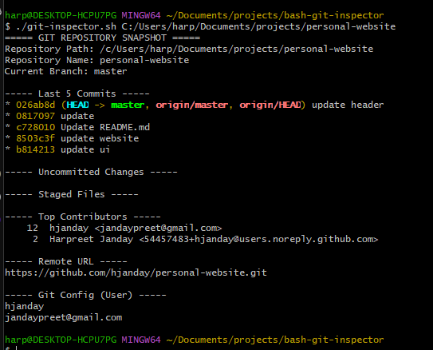

git-inspector
A lightweight Bash script that inspects a local Git repository and displays useful metadata including branch information, recent commits, contributor stats, remotes, and working directory status.

## Features

- Shows current branch and last 5 commits
- Lists uncommitted and staged changes
- Displays top contributors and remote URL
- Retrieves Git config for user name and email

## Requirements

- Bash (Git Bash or WSL on Windows)
- Git installed and available in your PATH

## How to Use?

```bash
./git-inspect.sh /path/to/local/git/repo
```


## Example output

